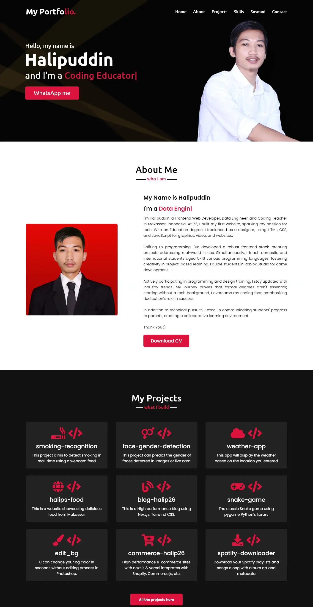

## Description

This portfolio is a personal project that showcases my works in web development. I used HTML, CSS, and JavaScript to build it.

## Features

- Responsive display for various devices.
- Project gallery with short descriptions.
- Contact information and links to social media.

### 💻 &nbsp;Preview

- 📫 How to reach me: &nbsp; 

---

### 🛠 &nbsp;Languages and Tools

&nbsp;
&nbsp;
&nbsp;

&nbsp;
&nbsp;

---

## Halip26's Portfolio

### About Me

I'm Halipuddin, a **Front-End Developer** based in Makassar, Indonesia. Here are some highlights about me:

- I work as a Front-End Developer, contributing to both frontend and sometimes backend development for web applications.
- As a **Coding Educator** at BrightChamps, I enjoy sharing my knowledge and helping others learn.
- I'm passionate about **Technical Content Writing** and often solve problems on platforms like GeeksforGeeks and Stack Overflow.
- In my free time, I love reading tech articles and occasionally playing games. 🎮

### Projects

Check out some of my projects:

1. **Image Editor**: A simple image editor written in HTML, CSS, and JavaScript. You can change your background color in seconds without any complex editing process in Photoshop. [View Project](https://halip26.github.io/image-editor/)
2. **Cek Palindrom**: A website to check if a given string is a palindrome. Written in HTML, CSS, and JavaScript. [View Project](https://halip26.github.io/cek-palindrom/)
3. **smoking-recognition**: This project aims to detect smoking in real-time using a webcam feed. [View Project](https://github.com/Halip26/smoking-recognition/)
4. **face-gender-detection**: This project can predict the gender of faces detected in images or live camera. [View Project](https://github.com/Halip26/face-gender-detection/)
5. **weather-app**: This app will display the weather based on the location you entered. [View Project](https://github.com/Halip26/weather-app/)
6. **halips-food**: This is a website showcasing delicious food from Makassar. [View Project](https://github.com/Halip26/halips-food/)
7. **blog-halip26**: This is a High performance blog using Next.js, Tailwind CSS. [View Project](https://github.com/Halip26/blog-halip26/)
8. **snake-game**: The classic Snake game using pygame Python's library. [View Project](https://github.com/Halip26/snake-game/)
9. **edit_bg**: You use this project to change your bg color in seconds without editing process in Photoshop. [View Project](https://github.com/Halip26/edit_bg/)
10. **commerce-halip26**: High performance e-commerce sites with next.js & vercel integrates with Shopify, Commerce.js, etc. [View Project](https://github.com/Halip26/commerce-halip26/)

### Blog Posts

I occasionally write blog posts on various topics related to web development. Here are a few recent ones:

- [10 VS Code Extensions to Increase Productivity for Web Developers](https://halip26.github.io/blog-halip26/vs-code-extensions-web-developers/)
- [Node.js vs PHP: Which Is the Top Server-Side Programming Language?](https://halip26.github.io/blog-halip26/nodejs-vs-php-server-side-language/)
- [Project Simple ETL with Pandas](https://blog-halip26.thedev.id/post/project-simple-etl-with-pandas)
- [Algoritma Kehidupan](https://blog-halip26.thedev.id/post/algoritma-kehidupan)

### Connect with Me

Feel free to reach out! You can find me on [GitHub](https://github.com/Halip26) or connect with me on [LinkedIn](https://www.linkedin.com/in/halipuddin/).

### Usage

1. Clone this repository or create an HTML file with the following content:
   - [index.html](index.html)

2. Create a `style.css` file with your desired styling for the timer display.

3. Create a `script.js` file with the JavaScript code you provided. This script handles the timer logic.

### License

This project is licensed under the MIT License - see the [LICENSE](LICENSE) file for details.
